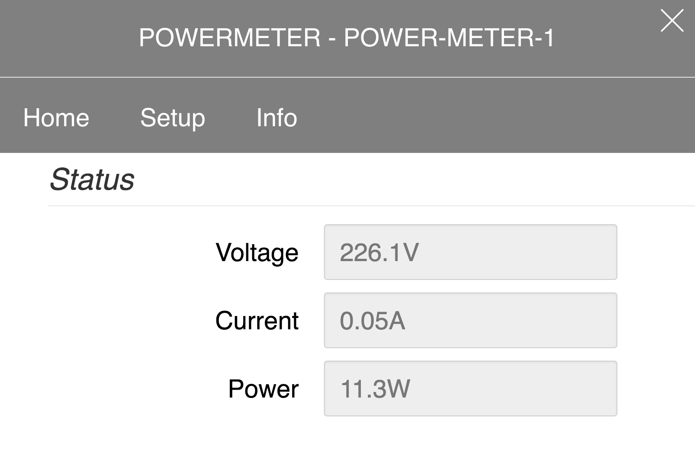

# ESP8266-PZEM004T

A WiFi enabled PowerMeter for AC Voltage, Current and Power.
Implementing a nice looking Web-Interface, a RESTful API, OpenHAB 1 & 2 Callbacks and a MQTT client.

## Precompiled Firmware
Find the precompiled firmware in the [firmware](https://github.com/thorsten-l/ESP8266-PZEM004T/tree/master/firmware) directory.

## Compile
This is a [PlatformIO](https://platformio.org/) project.

## Firmware Reset
1. Power on the PowerMeter (plug in)
2. Press down and hold the Button during the first 5s
3. Release Button when the WiFi LED starts rapidly fast blinking
4. The firmware reset ends after about 30s indicated by a permanent WiFi LED on.

## Default Settings
After a firmware reset the following values are set.

|    | value | description |
|----|-------|-------------|
| WiFi SSID | PowerMeter-`esp id` | SSID in accesspoint mode |
| IP Address | 192.168.192.1 | ip address in accesspoint mode |
| Admin password | admin | Setup admin password |
| OTA Hostname | wifi-socket-1 | *O*ver *T*he *A*ir hostname |
| OTA Password | otapass | OTA firmware upload password |
| OpenHAB Callback Enabled | **false** | |
| OpenHAB Version | 1 | Callback for OpenHAB version 1 or 2 |
| OpenHAB Item Voltage |  PowerMeter1Voltage | |
| OpenHAB Item Current |  PowerMeter1Current | |
| OpenHAB Item Power |  PowerMeter1Power | |
| OpenHAB Host | 192.168.1.1 | |
| OpenHAB Port | 80 | |
| OpenHAB Use Authentication | false | |
| OpenHAB User | user |  |
| OpenHAB Password | password | |
| OpenHAB SendingInterval | 60 | interval time in seconds |
| MQTT Enabled | **false** |  |
| MQTT ClientId | PowerMeter1 |  |
| MQTT Host | 192.168.1.1 | |
| MQTT Port | 80 | |
| MQTT Use Authentication | false | |
| MQTT User | user |  |
| MQTT Password | password | |
| MQTT Topic Voltage| powermeter1/voltage |  |
| MQTT Topic Current| powermeter1/current |  |
| MQTT Topic Power| powermeter1/power |  |
| MQTT Topic JSON| powermeter1/json | sending all values in JSON format |
| MQTT Sending Interval | 60 | interval time in seconds |

## Hardware

| hardware   | description | pins |
|----|-------|-------------|
|ESP8266 Mainboard|[WEMOS D1 mini lite](https://wiki.wemos.cc/products:d1:d1_mini_lite) |  |
|OLED Display|[WEMOS OLED Shield](https://wiki.wemos.cc/products:d1_mini_shields:oled_shield) | D1 (SCL,GPIO5), D2 (SDA,GPIO4)|
|AC Digital Multifunction Meter|[PZEM004T Module](https://de.aliexpress.com/item/AC-Digital-Multifunction-Meter-Watt-Power-Volt-Amp-Current-Test-Module-PZEM-004T-Factory-in-Stock/32732069106.html) | D5 (RX,GPIO14), D6 (TX,GPIO12) |
|WiFi LED | LED + 150&Omega; Resistor | D0 (GPIO16) |
|Button | Touch button | D7 (GPIO13) |

## References
- [PlatformIO](https://platformio.org/)
- [Arduino core for ESP8266 WiFi chip](https://github.com/esp8266/Arduino)
- [Async TCP Library for ESP8266](https://github.com/me-no-dev/ESPAsyncTCP)
- [Async Web Server for ESP8266 and ESP32](https://github.com/me-no-dev/ESPAsyncWebServer)
- [Arduino-pubsubclient - A client library for the ESP8266 that provides support for MQTT](https://github.com/heman4t/Arduino-pubsubclient)
- [Pure.CSS - A nice CSS, as GZIP it is less than 4k so it is useful for embedded devices](https://purecss.io/)
- [ESP8266 OLED SSD1306 with 64x48 support](https://github.com/thorsten-l/esp8266-oled-ssd1306)
